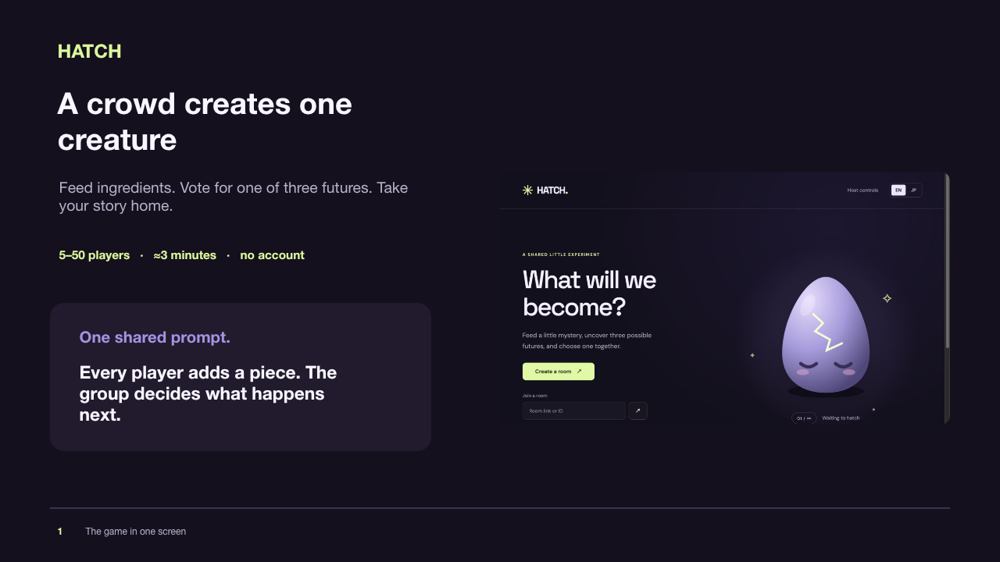

# HATCH — Crowd Monster

A live, shared creature game for 5–50 players. **English is the default.** The EN / JP tabs switch all player-facing instructions, generated names, explanations, outcomes, errors, titles, and sharing text without restarting the game. The selected language is remembered on that device.

## Pitch and implementation plan

[Three-slide pitch](docs/hatch-3slides.pptx) · [Implementation plan](docs/implementation-plan.md)



## Run locally

Requires Node.js 22+ and npm. Tested with Node.js 24.

```sh
npm ci
npm run build
npm start
```

Open [the app](http://localhost:3000) or [host controls](http://localhost:3000/host). The host key is acquired automatically only for a direct localhost connection when APP_ORIGIN is local and no HOST_SECRET is configured. Public deployments always require the host key. Create a room, open the big screen, then join from a second tab or another device. Start the game after participants have joined.

The initial mode uses the three bundled original SVG creatures as clearly labeled fallback artwork. It needs no cloud credentials. It still runs a real shared server: players, counts, votes and results are not browser-only mock data.

For devices on the same network, set `APP_ORIGIN` to the reachable server address and set a strong `HOST_SECRET` in `.env`. The QR code uses this address. An HTTPS origin is recommended for real phones because secure-context features such as clipboard and random UUID APIs are not universally available over LAN HTTP. For a venue use a publicly reachable HTTPS server rather than relying on localhost URLs.

## The game

Lobby → 5-second countdown → 15-second feeding → 1-second final batch → three futures → vote → birth → optional final adventure → public and personal keepsakes.

- A participant receives one balanced ingredient assignment. Late arrivals spectate.
- Cumulative tap batches are sent every 500ms with sequence numbers. Duplicates and late arrivals never increase counts.
- Tap allowance: initial burst 8, refill 8/sec, maximum 120 per person per round. Rejected excess never reappears later.
- Votes are immutable and one per participant. Ties and no-vote rounds use an order saved when the room is created.
- Recipes, trait weights, names, endings and titles are in `src/shared/config.ts` and the deterministic engine.
- Contributions and mutation thresholds have factual explanations in both languages. They do not claim that a diffusion model always drew a requested feature.
- Completed results are saved to `data/sessions` and images to `data/assets`. Keep that directory on persistent storage. Restarting interrupts an unfinished game instead of pretending to recover unacknowledged taps.

## Split demo hosting

The current demo uses **Daytona for the React screens and the Mac for the game API**. Browsers connect directly to the Mac through an HTTPS Cloudflare Quick Tunnel. Neo4j is connected from the Mac; Daytona does not make database calls. CORS accepts the configured Daytona APP_ORIGIN only. Host authentication remains required.

Keep the Mac awake and online, and keep both the API process and tunnel running. Closing the laptop or stopping the tunnel disconnects the game. The tunnel URL changes when recreated; deploy the frontend again with the new URL. GPU generation is currently stopped and the game uses labeled fallback illustrations.

To restart this demo with the existing private configuration:

```sh
# Terminal 1, from the app directory
caffeinate -i npm run demo:server
# Terminal 2, using the installed official cloudflared binary
cloudflared tunnel --url http://127.0.0.1:3001
# Terminal 3, pass the HTTPS URL printed by cloudflared
npm run demo:deploy -- https://YOUR-TUNNEL.trycloudflare.com
```

`.env.demo` must contain PORT=3001, the Daytona URL as APP_ORIGIN, HOST_SECRET, DATA_DIR, and the Neo4j credentials. It is ignored by Git. The management key stays in the local `.env`. The deployment command targets only the existing approved sandbox and switches its process to static frontend hosting.

## Verified demo status — 2026-09-12

- Neo4j: connected; a complete two-player game and personal contribution paths were persisted and queried.
- Nosana: one smoke run generated three images in 18.0 seconds. The GPU deployment was then stopped within the approved 30-minute window. The verified workflow is included.
- Daytona: authentication fixed and app deployed. [Open HATCH](https://3000-56d9f70b-3ec8-4729-9c35-593aff0ce322.daytonaproxy01.net). The sandbox auto-stops after 30 minutes of inactivity; auto-delete is disabled. The host key is stored outside Git in `data/daytona-host-key.txt`.
- Local play: full game flow verified, 13 tests passed, production build passed. EN is the default, with EN / JP tabs.

## External connections

Copy `.env.example` to `.env`, fill only the settings you have, and restart the server. Never commit `.env` or `data/`.

**Neo4j:** supply URI, username, password and database. The server seeds versioned materials, traits and recipes, then projects contributions, mutation events, candidates, votes, the monster and outcome. At feeding close it reads trait totals back from the graph. Personal contribution paths are queried after the game. A missing or unavailable database does not stop local play; the host status distinguishes that from a verified graph connection.

**Nosana:** see [workflow setup](workflows/README.md). Set `IMAGE_PROVIDER=nosana` and provide a verified ComfyUI API workflow and node mapping. The application submits three different prompts, observes job history, copies images to its own storage and substitutes fallback art for missing images at 45 seconds. An uncertain POST is not automatically repeated. Only images actually returned from the deployment are labeled as live generated.

```sh
npm run smoke:gpu
```

**Daytona:** the repository contains a deployment script for an explicitly selected, already approved sandbox. Set `DAYTONA_API_KEY`, `DAYTONA_SANDBOX_ID` and the runtime connections, build, then run:

```sh
npm run daytona
```

It rejects malformed or masked API keys, starts the sandbox when needed, uploads the built app and runtime configuration, installs runtime dependencies, creates a long-lived process and checks `/api/health`. It does not create an account, buy credits, create an API key, or change a sandbox to public. A private sandbox gets a one-hour signed preview URL. The generated host key is saved locally to `data/daytona-host-key.txt`; management API keys are not forwarded into the app runtime. Starting the selected sandbox can consume credits. This is a first-deployment script; stop an existing HATCH process before redeploying to the same port.

Preview expiration and sandbox shutdown also end result access. For seven-day keepsakes, maintain a stable HTTPS origin and persistent `data/` storage for that period. This build does not silently publish to a second hosting provider.

## Verify

```sh
npm test
npm run build
# With the local server running and no active room:
node --import tsx scripts/test-live.ts
```

Unit tests cover duplicate/out-of-order taps, the hard deadline, capped totals, precise mutation attribution, session isolation, deterministic choices, vote locking, trial/no-trial completion, a 50-participant simulation and bilingual copy. The live test creates a two-player session via HTTP and follows it through sharing; it takes about two minutes.

Cloud logins are not app credentials. Cloud connectivity, GPU performance, public mobile access and ongoing hosting must be verified against the configured accounts. Host status never treats the fallback renderer as a live GPU connection.

## 日本語

参加型育成ゲームです。**初期表示はEN**。右上のEN／JP切替で、操作説明・怪物名・進化理由・結末・称号・エラー・共有文を切り替えます。操作中に切り替えてもゲームは継続し、選択言語は端末に保存します。

起動は`npm ci` → `npm run build` → `npm start`。[ホスト画面](http://localhost:3000/host)でルームを作り、大画面と参加画面を開いてください。同じネットワークのスマホから参加する場合は、`.env`の`APP_ORIGIN`をスマホから届くサーバーURLへ変更します。本番会場ではHTTPS公開先を推奨します。

初期状態では同梱の代替イラストを使い、外部キーなしで参加から個人結果まで遊べます。外部接続は`.env.example`を参照。Neo4jは元のDBパスワード、Nosanaは稼働中ComfyUIのエンドポイントと成功済みAPI形式ワークフローが必要です。Chromeにログインしているだけでは、サーバーからの接続設定にはなりません。

結果と画像は`data/`に保存します。途中でサーバーが再起動した場合は、その回を中断として扱います。結果URLを持ち帰れる期間は、公開URLと保存先を維持する期間に依存します。永続ホスティング、個人OGP画像、動画・音声生成、複数会場や多プロセス運用は本実装の対象外です。
